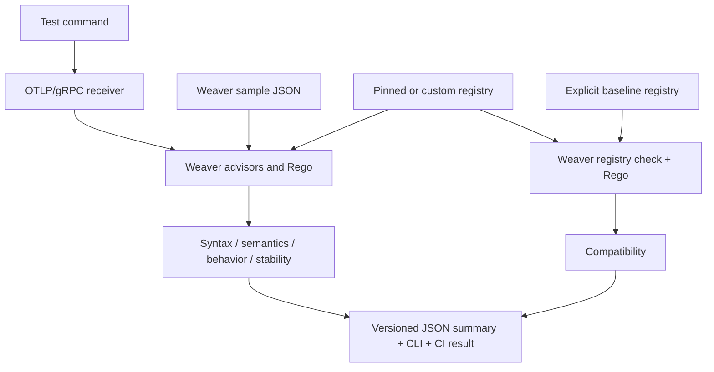

# Contract layers and policy extension

The engine separates correctness dimensions from their representation. Syntax, semantics, behavior, and compatibility/evolution are dimensions. Weaver registry YAML, Rego, OTLP/Protobuf, and JSON Schema are existing representations. Stability is reported separately because a valid observation can use an experimental or deprecated definition.

## Pipeline



`otel-check dotnet test` is shorthand for `otel-check run -- dotnet test`. Use the explicit `run` form to supply checker options before `--`; everything after it belongs to the workload. `status`, `check`, and `run` remain reserved subcommands. Shell composition is explicit: `otel-check run -- bash -c 'your commands'`.

## Result semantics

| Status | Meaning |
| --- | --- |
| `PASS` | The stated checks had observations (or an explicit registry comparison), with no findings. |
| `WARN` | Non-violation findings, or incomplete maturity coverage for mixed known/unknown definitions. |
| `FAIL` | An observed rule violation; malformed input is also reported as a syntax failure. |
| `NOT_CHECKED` | The layer lacks evidence, such as no HTTP spans or no baseline. |
| `ERROR` | The engine, policy, registry, or assessment failed; a compliance result cannot be established. |

The process exit is a separate gate. `--fail-on` selects `violation` (default), `improvement`, or `information`. `--require` may be repeated to block on absent layer evidence. It does not increase rule coverage or mean that all conceivable contracts are checked. `fully_evaluated` means every listed layer has a result within its stated scope, including FAIL; it is not a universal certification. File checks have a null workload exit. Failed workloads never pass the gate, even if the observed telemetry passes.

Each final report has `schema_version: 2` and conforms to [the summary schema](../schemas/summary.schema.json). `evidence_file` plus each finding's `evidence_path` identifies the underlying JSON evidence; paths use JSON Pointer notation. `compatibility.log` is empty for a comparison with no diagnostics. A count of one in compatibility means one registry pair was compared, not one API or attribute. Existing `state`, `findings` aggregate counts, `entities`, and `report_path` remain available when telemetry assessment completes. Detailed findings are under `layers`.

## Bundled checks and limits

**Syntax:** Weaver's deserializer checks the sample representation. Its type and enum advisors are reported here. Additional Rego verifies a supplied primitive/array value against its declared/inferred type, or the registry primitive type when inference is unavailable. This prevents an explicit `type: int` from hiding a string value. Signed integer bounds are checked; null values and preserved null array entries remain allowed by the [OTel common specification](https://github.com/open-telemetry/opentelemetry-specification/blob/v1.60.0/specification/common/README.md#anyvalue). General AnyValue maps/heterogeneous arrays are not globally forbidden. This layer covers decoded samples and available type evidence; it does not validate every OTLP wire constraint, unknown fields discarded by normalization, or values that are absent from name-only samples.

**Semantics:** Weaver's registry/name/unit/instrument/requirement advisors, its original OTel naming Rego, and the HTTP method rule. Requirements apply only where Weaver can match and assess them. Conditional requirements expressed only as prose are not automatically executable. The engine does not claim that every HTTP or other protocol SemConv requirement is implemented. Unknown names retain Weaver findings; custom names should use the intended registry.

**Behavior:** The [HTTP SemConv 1.44.0](https://github.com/open-telemetry/semantic-conventions/blob/v1.44.0/docs/http/http-spans.md#status) rules are applied only to client/server spans carrying `http.request.method` or `http.response.status_code`. The two checks are: 1xx–3xx responses cannot use span status `Ok` (Unset or Error remains possible); an HTTP span explicitly marked Error needs a non-empty `error.type`. The HTTP method is also required, reported under semantics. The checker does not infer whether a 4xx/5xx must be an error because instrumentation may have additional context. No HTTP spans means NOT_CHECKED. A passing workload exit alone is never used as behavior PASS. The normalized span model drops trace IDs and timestamps, so these rules do not prove propagation, retries, idempotency, durations, state ordering, or cross-request behavior. Additional policies cannot recover evidence that was not retained.

**Stability:** Weaver's `not_stable` and `deprecated` findings for matched observations. Unknown definitions cannot establish maturity; all-unknown observations yield NOT_CHECKED. Mixed known/unknown observations warn about the coverage gap. Registry version, definition maturity, and SDK implementation support are separate facts.

**Compatibility:** `--baseline-registry` invokes Weaver's real registry comparison with `comparison_after_resolution` Rego. For stable baseline attributes, the policy rejects removal/rename, primitive/template type changes, removal/change of existing enum member IDs or values, and maturity regression. Enum additions, editorial changes, and transition to deprecated are allowed. For stable metrics, it rejects removal/rename and changed unit or instrument. These are conservative project evolution rules: they do not cover all metric dimension changes, spans/events/entities, generated SDK source compatibility, wire compatibility, or changes to unstable contracts. A missing/invalid baseline cannot produce compatibility PASS. Registry resolution errors remain ERROR even when policy findings are also available.

## Extend with existing Rego

```bash
./otel-check check \
  --policy examples/policies/service.rego \
  --advice-data 'examples/policy-data/*.json' \
  examples/valid.json
```

`--policy` accepts a file or directory and may be repeated. All bundled policies stay loaded. Files are copied into each run with SHA-256 hashes; both telemetry and compatibility evaluate that snapshot. Live advisors use Weaver's `live_check_advice` package, `input.sample`, `input.registry_attribute`, `input.registry_group`, `input.resource`, and `input.instrumentation_scope`. Extra JSON/YAML data uses Weaver's existing `--advice-data` glob and namespace rules. Reserve Weaver's built-in data keys for the engine.

Policies return standard Weaver `PolicyFinding` objects through `deny`. Existing IDs `type_mismatch`/`undefined_enum_variant` map to syntax, and `not_stable`/`deprecated` map to stability. Custom IDs may use `syntax.`, `semantics.`, `behavior.`, or `stability.` to classify a finding; otherwise they fall under semantics. This is a reporting convention, not a new rule language. Custom behavior failures are reported even without an HTTP span; the absence of a custom finding alone does not create evidence for a behavior PASS.

For additional compatibility rules, use `comparison_after_resolution`: Weaver provides the candidate as `input` and the baseline as `data`, both in its v2 resolved representation. The same `--policy` input can hold both packages. Comparison findings stay in compatibility. Invalid policies fail the assessment rather than being ignored.

See the [pinned Weaver advisor documentation](https://github.com/open-telemetry/weaver/blob/38befce4bc68fe320d20f189465c93835ac20c12/crates/weaver_live_check/README.md#custom-advisors) and [baseline policy example](https://github.com/open-telemetry/weaver/blob/38befce4bc68fe320d20f189465c93835ac20c12/tests/v2_check_baseline/next/comparison_after_resolution_error.rego) for the upstream interfaces.

## Upstream policy attribution

[`policies/live/upstream.rego`](../policies/live/upstream.rego) is an unmodified copy of Weaver's `defaults/policies/live_check_advice/otel.rego` at commit `38befce4bc68fe320d20f189465c93835ac20c12`. Weaver's `--advice-policies` normally replaces its default Rego, so bundling this copy preserves the standard advisors while adding contract rules. The upstream [Apache-2.0 license](../policies/LICENSE.weaver) accompanies it. Review and update the copy alongside the Weaver engine pin. The other bundled Rego files are this repository's thin contract policy layer.
